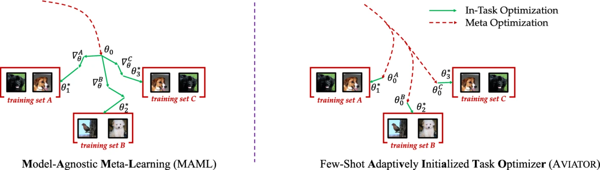
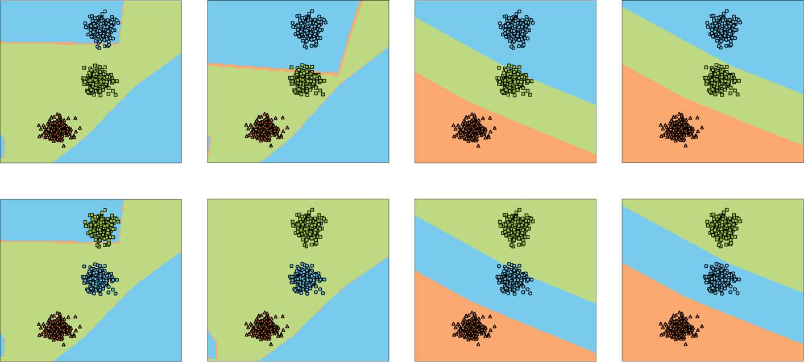

# Few-Shot Learning with Adaptively Initialized Task Optimizer (AVIATOR)

The code repository for "Few-shot learning with adaptively initialized task optimizer: a practical meta-learning approach" [[paper]](https://link.springer.com/article/10.1007/s10994-019-05838-7) (Accepted by Machine Learning 2020) in PyTorch. If you use any content of this repo for your work, please cite the following bib entry:

    @article{ye2020aviator,
      author    = {Han-Jia Ye and
				   Xiang-Rong Sheng and
				   De-Chuan Zhan},
	  title     = {Few-shot learning with adaptively initialized task optimizer: a practical
				   meta-learning approach},
	  journal   = {Machine Learning},
	  volume    = {109},
	  number    = {3},
	  pages     = {643--664},
	  year      = {2020}
    }

## Adaptively Initialized Task Optimizer

Considering the data collection and labeling cost in real-world applications, training a model with limited examples is an essential problem in machine learning, visual recognition, etc. Directly training a model on such few-shot learning (FSL) tasks falls into the over-fitting dilemma, which would turn to an effective task-level inductive bias as a key supervision. By treating the few-shot task as an entirety, extracting task-level pattern, and learning a task-agnostic model initialization, the model-agnostic meta-learning (MAML) framework enables the applications of various models on the FSL tasks. Given a training set with a few examples, MAML optimizes a model via fixed gradient descent steps from an initial point chosen beforehand. Although this general framework possesses empirically satisfactory results, its initialization neglects the task-specific characteristics and aggravates the computational burden as well. In this manuscript, we propose our AdaptiVely InitiAlized Task OptimizeR (AVIATOR) approach for few-shot learning, which incorporates task context into the determination of the model initialization. This task-specific initialization facilitates the model optimization process so that it obtains high-quality model solutions efficiently. To this end, we decouple the model and apply a set transformation over the training set to determine the initial top-layer classifier. Re-parameterization of the first-order gradient descent approximation promotes the gradient back-propagation. Experiments on synthetic and benchmark data sets validate that our AVIATOR approach achieves the state-of-the-art performance, and visualization results demonstrate the task-adaptive features of our proposed AVIATOR method.



## Prerequisites

The following packages are required to run the scripts:

- [PyTorch-1.4 and torchvision](https://pytorch.org)

- Package [tensorboardX](https://github.com/lanpa/tensorboardX)

- Dataset: please download the dataset and put images into the folder data/[name of the dataset, miniimagenet or cub]/images

- Pre-trained weights: please download the [pre-trained weights](https://drive.google.com/open?id=14Jn1t9JxH-CxjfWy4JmVpCxkC9cDqqfE) of the encoder if needed. The pre-trained weights can be downloaded in a [zip file](https://drive.google.com/file/d/1XcUZMNTQ-79_2AkNG3E04zh6bDYnPAMY/view?usp=sharing).

## Dataset

### MiniImageNet Dataset

The MiniImageNet dataset is a subset of the ImageNet that includes a total number of 100 classes and 600 examples per class. We follow the [previous setup](https://github.com/twitter/meta-learning-lstm), and use 64 classes as SEEN categories, 16 and 20 as two sets of UNSEEN categories for model validation and evaluation, respectively.

### CUB Dataset
[Caltech-UCSD Birds (CUB) 200-2011 dataset](http://www.vision.caltech.edu/visipedia/CUB-200-2011.html) is initially designed for fine-grained classification. It contains in total 11,788 images of birds over 200 species. On CUB, we randomly sampled 100 species as SEEN classes, and another two 50 species are used as two UNSEEN sets. We crop all images with given bounding boxes before training. We only test CUB with the ConvNet backbone in our work.

## Code Structures
There are four parts in the code.
 - `model`: It contains the main files of the code, including the dataloader, the network architectures, and baseline (e.g., MAML), and comparison models.
 - `data`: Images and splits for the data sets.
 - `saves`: The pre-trained weights of different networks.
 
## Synthetic Classification Experiments
AVIATOR is adaptive when we exchange the position of classes in different tasks, so that with a fewer steps of updates AVIATOR can get good performance. There are three steps for the synthetic classification experiments.

- Set up the synthesis dataset 

  ```
  python generate_gmm_mean.py
  ```

  This will generate the mean of gaussian and place the result into

  ```
  gmm_mean.mat
  ```

- Train the AVIATOR model 

  ```
  python train_aviator_synthesis.py
  ```

  The model and the result will be saved in the directory

  ```
  toy_cls-MLP-AVIATOR-synthesis-5-3
  ```

- Evaluate

  ```
  python eval_aviator_synthesis.py
  ```



## Standard Few-shot Learning Results

Experimental results on few-shot learning datasets with Conv-4 backbone. We report our averaged results with 10,000 randomly sampled few-shot learning episodes for stablized evaluation.

**MiniImageNet Dataset**
|  Setups  | 1-Shot 5-Way | 5-Shot 5-Way |
|:--------:|:------------:|:------------:|
| MatchNet |     48.14    |     63.48   |
| ProtoNet |     47.74    |     66.68    |
| MAML (ours)|   46.47    |     62.71    |
| ProtoMAML|     52.05    |     67.36    |
| AVIATOR |   **54.97**  |   **68.37**  |


## Model Training and Evaluation for Benchmark Experiments
Please use **train_aviator_benchmark.py** and follow the instructions below. The file will automatically evaluate the model on the meta-test set with 10,000 tasks after given epochs.

## Arguments
The train_aviator_benchmark.py takes the following command line options:

**Task Related Arguments**
- `dataset`: Option for the dataset (`MiniImageNet` or `CUB`), default to `MiniImageNet`

- `way`: The number of classes in a few-shot task during meta-training/test, default to `5`

- `shot`: Number of instances in each class in a few-shot task during meta-training/test, default to `1`

- `query`: Number of instances in each class to evaluate the performance during meta-training/test, default to `15`

**Optimization Related Arguments**
- `max_epoch`: The maximum number of training epochs, default to `500`

- `lr`: Learning rate for the model, default to `0.001` with pre-trained weights

- `lr_mul`: The learning rate for the top layers will be multiplied by this value (usually with faster learning rate). Default to `10`

- `step_size`: The frequency to decrease the learning rate. Default to `20`

- `gamma`: Learning rate ratio for `step` scheduler, default to `0.5`

**Model Related Arguments**
- `gd_lr`: The inner loop gradient descent step size for MAML updates. Default to `0.01`

- `inner_iters`: The inner loop iterations for MAML updates. Default to `1`

- `model_type`: Types of the encoder, i.e., the convolution network (`ConvNet`), default to `ConvNet`

- `temperature`: Temperature over the logits, we #divide# logits with this value. It is useful when meta-learning with pre-trained weights. Default to `1`

**Other Arguments** 
- `orig_imsize`: Whether to resize the images before loading the data into the memory. `-1` means we do not resize the images and do not read all images into the memory. Default to `-1`

- `multi_gpu`: Whether to use multiple gpus during meta-training, default to `False`

- `gpu`: The index of GPU to use. Please provide multiple indexes if choose `multi_gpu`. Default to `0`

- `log_interval`: How often to log the meta-training information, default to every `50` tasks

- `eval_interval`: How often to validate the model over the meta-val set, default to every `1` epoch

- `save_dir`: The path to save the learned models, default to `./checkpoints`

Running the command without arguments will train the models with the default hyper-parameter values. Loss changes will be recorded as a tensorboard file.

## Training scripts for AVIATOR

For example, to train the 1-shot/5-shot 5-way AVIATOR model with ConvNet backbone on MiniImageNet:

    $ python train_aviator_benchmark.py  --max_epoch 200 --model_type ConvNet --dataset MiniImageNet --way 5 --shot 1 --query 15 --temperature 32 --lr 0.0001 --lr_mul 10 --inner_iters 10 --gd_lr 0.02 --step_size 50 --gamma 0.1 --gpu 0 --init_weights ./saves/initialization/miniimagenet/con-pre.pth

    $ python train_aviator_benchmark.py  --max_epoch 200 --model_type ConvNet --dataset MiniImageNet --way 5 --shot 5 --query 15 --temperature 16 --lr 0.0001 --lr_mul 10 --inner_iters 5 --gd_lr 0.001 --step_size 25 --gamma 0.1 --gpu 0 --init_weights ./saves/initialization/miniimagenet/con-pre.pth


## Acknowledgment
We thank the following repos providing helpful components/functions in our work.
- [ProtoNet](https://github.com/cyvius96/prototypical-network-pytorch)

- [FEAT](https://github.com/Sha-Lab/FEAT)